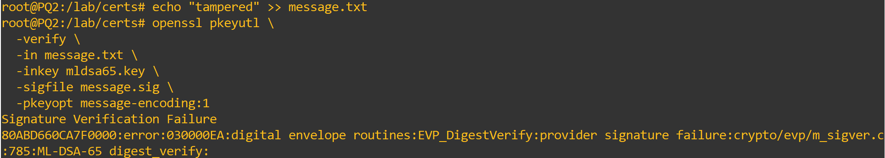
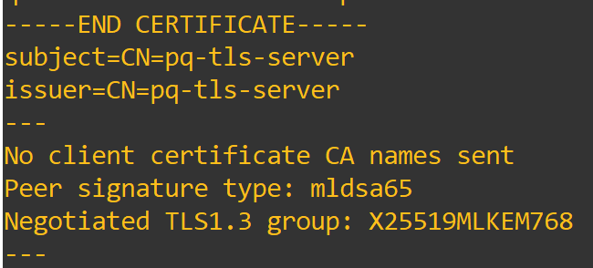

## Laboratory Experiments

We will now begin the PQ experiments, focusing on observing hybrid algorithms being used during a TLS handshake, comparing classical and hybrid key exchange methods during the handshake, seeing how ML-KEM functions independently, and testing group mismatches between hybrid and classical algorithms.

## TLS Handshake with Hybrid KEMs

For our first experiment, we will examine the commands available to force TLS to use a hybrid key exchange group and identify where it is referenced in both the terminal output and Wireshark.

First, we will look at the commands used to force a hybrid key exchange group. In theory, since X25519MLKEM768 is one of the available hybrid methods, it may be selected by default when supported by the implementation, but we can explicitly force its use for this experiment.

To do this, start the server as usual and then connect the client using the following command:

```bash
openssl s_client \
    -connect 10.10.10.1:4433 \
    -tls1_3 \
    -groups X25519MLKEM768 \
```

The TLS connection should be successfully established. By analyzing the Wireshark capture and the terminal output, we should find evidence that our hybrid key exchange group was used. Let's start with Wireshark:

<figure markdown id="figure-1">
  {width="600"}
  <figcaption>Figure 1: Hybrid Handshake Client side</figcaption>
</figure>

As shown in Figure 1, the Client Hello contains X25519MLKEM768 as the only offered key exchange group in the key_share extension. This is expected because we configured the client to restrict its available groups to this single group.

We can further confirm the negotiated group by examining the Server Hello in Figure 2:

<figure markdown id="figure-2">
  {width="600"}
  <figcaption>Figure 2: Hybrid Handshake Server side</figcaption>
</figure>

The Server Hello confirms that X25519MLKEM768 was selected for the key exchange.

We can also confirm the negotiated group through the information displayed in the terminal when the client connects to the server.

By looking at the negotiation section of the output shown in Figure 3, we can see information such as the cipher suite, protocol version, compression, public key information, and certificate verification result. We can also see the negotiated group, which in this case is our chosen X25519MLKEM768.

<figure markdown id="figure-3">
  {width="600"}
  <figcaption>Figure 3: Hybrid Handshake Client side terminal</figcaption>
</figure>

Although we can see all this evidence of the use of a hybrid key exchange group, the overall TLS 1.3 handshake structure remains largely unchanged. The main difference is the key exchange mechanism and the cryptographic material used during key establishment, which provides additional protection against future quantum attacks.

## Classic vs Hybrid KEMs in Handshakes

As we have seen previously, the overall TLS 1.3 handshake does not change when different key exchange groups are used. The main differences lie in the computational requirements and the amount of resources necessary to perform the handshake when using a classical method compared with a hybrid one.

Although hybrid methods provide additional post-quantum protection, they generally require more resources to generate and process their cryptographic material. They also result in larger handshake messages that must be transmitted across the network.

We can observe this difference by examining the size of the key share information in both the Client Hello and Server Hello from our hybrid test.

<figure markdown id="figure-4">
  {width="300"}
  <figcaption>Figure 4: Hybrid Handshake Client Hello length</figcaption>
</figure>

<figure markdown id="figure-5">
  {width="300"}
  <figcaption>Figure 5: Hybrid Handshake Server Hello length</figcaption>
</figure>

As shown in Figure 4, the Client Hello has a length of 1,440 bytes, with the key share alone taking 1,258 bytes, or approximately 87% of the entire packet.

Similarly, Figure 5 shows that the Server Hello has a length of 1,210 bytes, with the key share taking 1,124 bytes, or approximately 93% of the entire packet.

This represents a significant amount of space dedicated to key exchange material. While this difference may have little practical impact in a simulated environment, in a real-world scenario it can result in larger handshake messages, increased bandwidth requirements, and additional computational and energy costs.

We can compare these results with a classical key exchange group by establishing a new client connection:

```bash
openssl s_client \
    -connect 10.10.10.1:4433 \
    -tls1_3 \
    -groups X25519 \
```

We can then examine the resulting Client Hello in Wireshark.

<figure markdown id="figure-6">
  {width="300"}
  <figcaption>Figure 6: Classical Handshake Client Hello length</figcaption>
</figure>

As shown in Figure 6, the classical X25519 key share takes 38 bytes out of a total packet size of 210 bytes, or approximately 18% of the total packet.

Similarly, Figure 7 shows that the classical key share takes 36 bytes out of a total packet size of 122 bytes, or approximately 30% of the total packet.

<figure markdown id="figure-7">
  {width="300"}
  <figcaption>Figure 7: Classical Handshake Server Hello length</figcaption>
</figure>

The difference between the total packet sizes and the proportion of each packet occupied by the key exchange material is significant and demonstrates the expected overhead introduced by the hybrid construction.

Although hybrid key exchange provides additional protection against future quantum attacks, it naturally requires more cryptographic material than classical key exchange. This material requires additional resources to generate and process, as well as additional bandwidth to store and transmit.

This illustrates one of the main trade-offs between classical and hybrid methods: classical methods require fewer resources but are vulnerable to sufficiently powerful future quantum computers, while hybrid methods provide additional post-quantum protection at the cost of increased computational, storage, and network requirements.

## ML-KEM primitive

The use of ML-KEM in a key exchange involves the encapsulation and decapsulation of a shared secret. In this experiment, we will perform the encapsulation and decapsulation process locally to understand how it works, what it does, and how the resulting shared secret can be verified.

We begin by creating a directory to work in on PQ1 and generating a key using ML-KEM-768:

```bash
mkdir -p /lab/mlkem
cd /lab/mlkem

openssl genpkey \
    -algorithm ML-KEM-768 \
    -out mlkem768.key
```

We can inspect the generated key with:

```bash
openssl pkey \
    -in mlkem768.key \
    -text \
    -noout
```

This displays information about the generated ML-KEM key material, including the components used for encapsulation and decapsulation.

Next, we will generate the public key and use it to encapsulate a shared secret:

```bash
openssl pkey \
    -in mlkem768.key \
    -pubout \
    -out mlkem768.pub

openssl pkeyutl \
    -encap \
    -inkey mlkem768.pub \
    -pubin \
    -out mlkem768.ct \
    -secret mlkem768.secret
```

This operation generates a shared secret and encapsulates it, producing the corresponding ciphertext.

We will now decapsulate the ciphertext and compare the resulting secret with the original shared secret, expecting them to match:

```bash
openssl pkeyutl \
    -decap \
    -inkey mlkem768.key \
    -in mlkem768.ct \
    -secret mlkem768.decapsulated

sha256sum mlkem768.secret
sha256sum mlkem768.decapsulated

cmp mlkem768.secret mlkem768.decapsulated
```

The first command performs the decapsulation and writes the resulting shared secret to mlkem768.decapsulated. The next two commands calculate the SHA-256 hashes of the original and decapsulated secrets, allowing us to verify that they are identical. Finally, cmp directly compares the two files.

If the operation was successful, the two SHA-256 hashes should be identical, and cmp should produce no output because the files are identical, as shown in Figure 8.

<figure markdown id="figure-8">
  {width="600"}
  <figcaption>Figure 8: MLKEM encapsulation check</figcaption>
</figure>

## ML-DSA Signatures as Authentication Material

For this experiment, we will generate a signing key using the post-quantum algorithm ML-DSA-65 and test how it functions by signing a text file, verifying the signature, modifying the file, and then attempting to verify the signature again.

First, generate the key we will use and create the text file:

```bash
openssl genpkey \
  -algorithm ML-DSA-65 \
  -out mldsa65.key

echo "Secure Tunneling Labs post-quantum signature test" > message.txt
```

With the key and message file ready, we will now sign the file using the generated key:

```bash
openssl pkeyutl \
  -sign \
  -in message.txt \
  -inkey mldsa65.key \
  -out message.sig \
  -pkeyopt message-encoding:1
```

We now have a signature generated using our signing key and the contents of the message file. We can verify the signature with:

```bash
openssl pkeyutl \
  -verify \
  -in message.txt \
  -inkey mldsa65.key \
  -sigfile message.sig \
  -pkeyopt message-encoding:1
```

This should result in a successful verification because the message remains unchanged and the key used to generate the signature is the same key used to verify it.

Now, let's tamper with the message and see whether the verification remains successful.

```bash
echo "tampered" >> message.txt

openssl pkeyutl \
  -verify \
  -in message.txt \
  -inkey mldsa65.key \
  -sigfile message.sig \
  -pkeyopt message-encoding:1
```

We should now see an output similar to the one shown in Figure 9, where the verification fails because the message is now different from the one that was originally signed. As a result, the signature no longer matches the modified message, causing the verification check to fail.

<figure markdown id="figure-9">
  {width="600"}
  <figcaption>Figure 9: MLDSA Signature check</figcaption>
</figure>

As we can see, post-quantum methods are not limited to key exchange. Some, such as ML-DSA, are designed to provide authentication through digital signatures that are intended to resist attacks from sufficiently powerful quantum computers.

## ML-DSA Certificate Authentication in TLS

For this experiment, we will use ML-DSA to generate a key that will be used to generate a certificate. This certificate will then be used to authenticate the server during a TLS connection.

First, generate the new key and create the certificate:

```bash
openssl genpkey \
  -algorithm ML-DSA-65 \
  -out mldsa-server.key

openssl req \
  -new \
  -x509 \
  -key mldsa-server.key \
  -out mldsa-server.crt \
  -days 365 \
  -subj "/CN=pq-tls-server"
```

Now that we have our certificate, copy it to the client so that it can use the certificate to authenticate the server:

```bash
In PQ2:

cat mldsa-server.crt

In PQ1:

nano mldsa-server.crt
```

Now, start the server, which will present its certificate and use ML-KEM as the key exchange mechanism:

```bash
openssl s_server \
  -accept 4434 \
  -cert mldsa-server.crt \
  -key mldsa-server.key \
  -tls1_3 \
  -groups X25519MLKEM768 \
```

Then, start the client, which will verify the server's certificate and use the same key exchange group:

```bash
openssl s_client \
  -connect 10.10.10.1:4434 \
  -tls1_3 \
  -groups X25519MLKEM768 \
  -CAfile mldsa-server.crt \
  -verify_return_error \
```

The connection should be successful because the certificate can be correctly verified. Although the use of the ML-DSA certificate is not immediately visible in the Wireshark packet exchange, we can confirm it from the terminal output, as shown in Figure 10:

<figure markdown id="figure-10">
  {width="400"}
  <figcaption>Figure 10: MLDSA Certificate in TLS</figcaption>
</figure>

We can see that the certificate was received and successfully verified because the TLS connection was established. The terminal output also confirms that the certificate's signature algorithm is ML-DSA-65.

This demonstrates that certificate-based authentication in real-world scenarios is no longer limited to classical cryptographic algorithms. Post-quantum signature algorithms such as ML-DSA can also be used for certificate-based authentication in TLS.

## Hybrid Group Mismatch

For our final experiment, we will examine how TLS handles mismatches between key exchange groups, including mismatches between classical and hybrid groups and between different hybrid groups.

First, we will configure the server to use only the classical X25519 group:

```bash
openssl s_server \
    -accept 4433 \
    -cert /lab/certs/server.crt \
    -key /lab/certs/server.key \
    -tls1_3 \
    -groups X25519 \
    -www
```

Then, we will connect to it using a client restricted to the hybrid X25519MLKEM768 group:

```bash
openssl s_client \
    -connect 10.10.10.1:4433 \
    -tls1_3 \
    -groups X25519MLKEM768 \
```

The handshake should fail because the client and server do not have a mutually supported key exchange group.

The resulting TLS alert can be observed during the handshake. In this case, the alert is SSL alert number 40, as shown in Figure 11. This alert corresponds to a handshake failure, indicating that the peers could not successfully negotiate the required TLS parameters.

<figure markdown id="figure-11">
  {width="600"}
  <figcaption>Figure 11: Handshake failure between classic and hybrid groups</figcaption>
</figure>

We expected this outcome because the client and server are restricted to different groups. However, what happens if we try the same experiment using two different hybrid groups?

To do this, reset the server and use the following commands:

```bash
openssl s_server \
    -accept 4433 \
    -cert /lab/certs/server.crt \
    -key /lab/certs/server.key \
    -tls1_3 \
    -groups SecP384r1MLKEM1024 \
    -www
```

This will start a new server restricted to the SecP384r1MLKEM1024 hybrid key exchange group.

Then, reconnect using the same hybrid client as before and observe the outcome:

<figure markdown id="figure-12">
  {width="600"}
  <figcaption>Figure 12: Handshake failure between two hybrid groups</figcaption>
</figure>

As we can see in Figure 12, even though both groups are hybrid, a mismatch still occurs and the handshake ends with an error.

The important point is that the failure does not occur simply because one group is classical and the other is hybrid. Instead, the handshake fails because the client and server do not share a mutually supported group.

The same principle applies when both groups are hybrid. Even though X25519MLKEM768 and SecP384r1MLKEM1024 are both hybrid groups, they are different key exchange groups and cannot be used interchangeably.

TLS does not require the client and server to use groups from the same algorithm family. Instead, they must have at least one mutually supported group that can be successfully negotiated and used for the handshake.

With this final experiment, we have completed the PQ and hybrid key exchange section. We hope that this laboratory has helped you learn more about post-quantum and hybrid methods, including what they are, how they differ from classical methods, how they are constructed, how they are used, and the advantages and disadvantages associated with their deployment.

We hope you have enjoyed our laboratories and that we will see you again!
